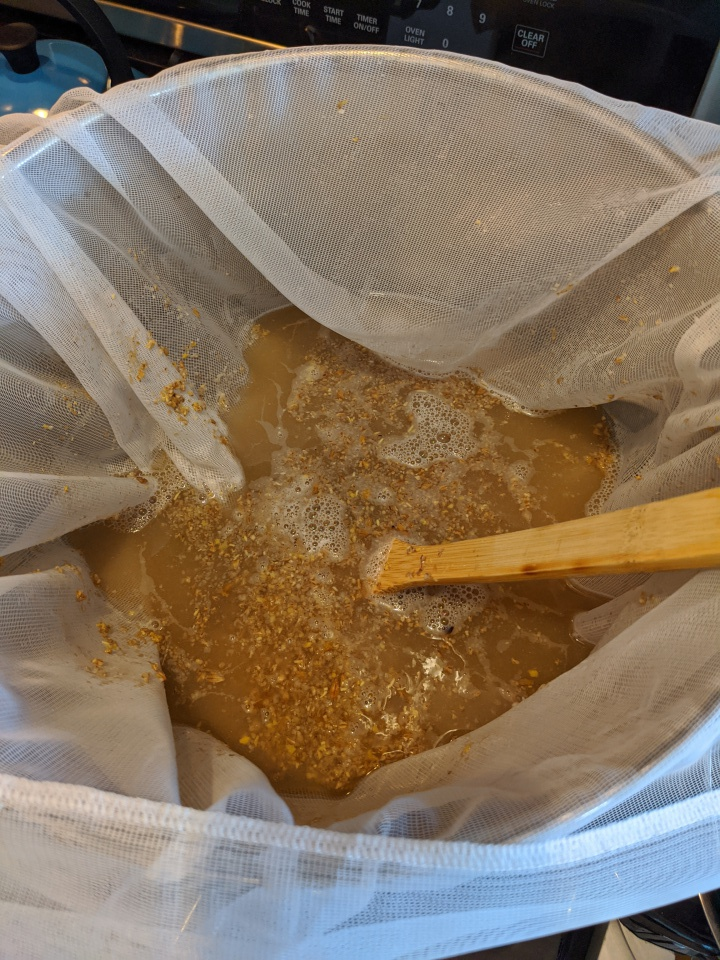
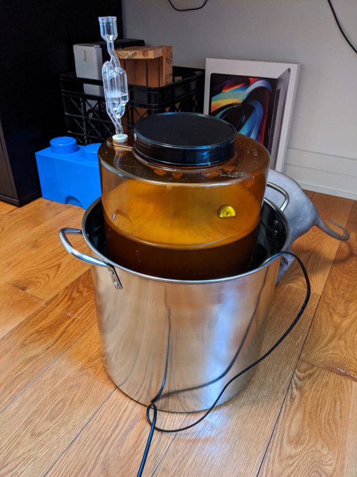

# BIAB Cream Ale

Trying to replicate the Pilsner version of the Cream Ale Experiment,
but this time with grains (Pilsner malt) and (flaked) corn. And Perle
instead of Amarillo. Come to think of it I guess this is pretty
different from the experiment.

## Recipe

Volume: 2.5 gal

Fermentables:
 - 4 lbs Belgian Pilsner malt
 - 0.7 lbs Flaked corn

Hops:
 - 0.5 oz Perle (8.2 AA)

Schedule:
 - 60 min: 0.2 g Perle
 - 10 min: 0.3 g Perle
           1/2 Whirlfloc tablet

Yeast: OSLO

Predictions:
 - OG: 1.049
 - FG: 1.009
 - ABV: 5.27%
 - IBU: 17.61
 - SRM: 2.95

Mash at 67 C / 153 F for 90 minutes in 2 gal. Sparge until 2.5 gal is
reached. Check SG and, if necessary, add DME to reach target OG. Boil.

## Brew day (2020-02-23)

BIAB! 90 minute mash. Keeping it between 150 and 156 F was pretty
straightforward. Had to pull up the bag and heat twice. Going for a
bit higher temperature before adding grains should remove at least one
of those. Although I failed to record the temp pre-grain so not sure
exactly how to adjust this going forward.

Sparged with 0.5 gal water at 165 F. Ended up with about 2 gal wort,
so 0.5 lost to grain. Could've done more bag squeezing for sure, but I
had no gloves so it got pretty hot and unpleasant. Topped off w tap
water to 2.5 gal, took gravity reading, added more water up to 3
gal. Finally added 5 drops of Fermcap.

SG: 1.050 (corrected for temp, 1.046 @ 37 C)

By my math, that's an efficiency of 71%. Exactly what I happened to
default to in Brewer's Friend, but a tad lower than what the internet
says BIAB has to offer. A pair of gloves for squeezing that bag could
be a good investment. OTOH, I hit my target OG spot on.

After 60 minutes of boiling I'd lost about 5/8 gal, i.e. 1/2 as
planned, and in addition to that about an 1/4 of 1/2 gal, i.e. 1/8 +
4/8. Topped off to 2.5 gal. Cooled to ~30 C. Let it sit for about an
hour or so for the trub to settle. Siphoned mostly clear wort into
fermenter, although it was definitely more cloudy than when using
extract. Got just over 2 gal in total.

Next, I washed the 5 gal brew kettle, attached an aquarium heater to
the inside (set to ~95 F), filled it with 30 C water, moved to the
synth room and plugged it in. I'll try to ferment this sucker near 37
C. I am a tad concerned about krausen reaching the airlock. That's why
I added Fermcap. Also noted that it seems to help with hot break,
since I saw essentially none of that when I started boiling. Very
convenient.

My hydrometer sample tube fell into the sink and broke, so I didn't
get a final gravity reading. Fortunately, I have the Tilt, which
confirms my pre-boil reading.

OG: 1.051

*Fermentor in water bath with temperature control*
