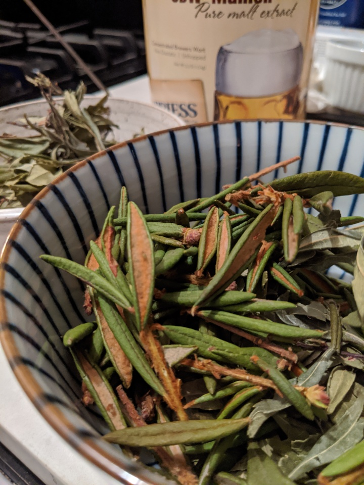

# Posh Gruit

Instead of hops, we'll primarily be using Bog Myrtle and Labrador Tea
for bittering.

The Labrador Tea is most likely Rhododendron Columbianum, also known
as western labrador tea. The more traditional herb for a gruit would
be _northern_ labrador lea (Rhododendron Tomentosum), a.k.a. wild
rosemary, or "skvattram" in Swedish. The western variety should work
well enough and was easier have shipped to NYC.

Bog Myrtle (Myrica Gale), a.k.a. sweetgale, is another common gruit
herb. It's called "pors" in Swedish, which is pronounced a bit like
_posh_. Hence, this experimental gruit is named _Posh Gruit_.

Recipe is largely inspired by [this
recipe](https://www.beercraftr.com/1-gallon-bog-myrtle-gruit/), but
adapted to extract brewing and uses a hop that I happen to have at
home.

## Recipe

Volume: 1 gal

Grain:
- 1 lbs Pilsen DME
- 0.6 lbs Munich LME
- 2.5 oz Carapils
- 2.5 oz Crystal 40L
- 1 oz Acidulated malt

Hops:
- 0.1 oz Chinook

Yeast: Wyeast 1728 (Scottish Ale)

Schedule:
- 60 min: 0.25 oz Bog Myrtle
- 50 min: 0.1 oz Chinook
-  1 min: 0.1 oz Bog Myrtle
-  1 min: 0.3 oz Labrador Tea

Predictions:
- OG: 1.072
- FG: 1.021
- ABV: 6.66%
- IBU: 19.36
- SRM: 8.91

## Brewday (2020-02-05)

Accidentally added 0.7 lbs LME, i.e. 0.1 lbs extra. Intentionally
added 1/5 whirlfloc tablet at 10 minutes. Other than that, everything
went according to plan. Fermentation kicked off within 12 hours.

Tasted mostly like a regular wort. Low bitterness, but still largely
like something bittered primarily with hops.

Tried to let this batch settle to eliminate trub transfer, but that
didn't work so well. The wort was very cloudy, full of gunk floating
around. Guessing it's from the herbs.

OG: 1.074
