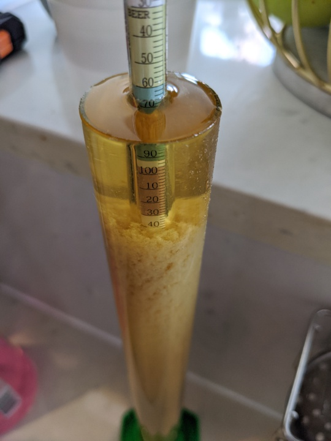

# BYO NEIPA

Never ever brewed a New England style IPA before. Sounds like it's a
bit challenging. Water profile matters, oxidation must be avoided, hop
amounts are massive, and hops are added in unusual ways at unusual
times.

Found [this recipe](https://byo.com/article/neipa-style-profile/) in
BYO magazine, and decided to give it a go. It's definitely very
similar to other recipes I've seen. Grain bill is typical, and the
Galaxy/Citra/Mosaic hop combo is popular. I will nudge the dry hop
numbers a bit though, to reduce the amount of leftover hops. Since
it's very hot both outdoors and indoors, I'll use Omega's Voss (kveik)
strain.

The original recipe recommends building up the water profile from RO
water, and since I'm curious about getting into water chemistry I
figured I do that too. Although it'll be distilled instead of reverse
osmosis water.

## Recipe

- Volume: 2.5 gal
- 60 minute boil

Water treatment (5 gal distilled water):
- 1/4 tsp 10% Phosphoric Acid (to pH 5.5 @ room temp)
- 3/4 tsp Calcium Chloride
- 1/4 tsp Calcium Sulfate (Gypsum)

Grain:
- 4.5 lbs Pale 2-Row
- 1 lb Golden Promise
- 8 oz Flaked Wheat
- 6 oz Flaked Oats
- 3 oz Rice Hulls

Hops and schedule:
- First wort
-- 0.75 oz Amarillo
- Flameout
-- 0.75 oz Amarillo
- Hopstand (20 min)
-- 0.5 oz Citra
-- 0.5 oz Galaxy
-- 0.5 oz Mosaix
- Dry hop (near end of primary fermentation):
-- 1.5 oz Citra
-- 1 oz Galaxy
- 0.5 oz Mosaic

Mash at 152 F for 60 minutes. Hop stand for 20 minutes when wort is
cooled to 180 F after boil.

Predictions (from BYO):
- OG: 1.061
- FG: 1.012
- ABV: 6.5%
- IBU: 56
- SRM:  5

Noticed that Brewer's Friend puts OG at 1.070 though. Haven't looked
into that.

## Brew Day (2020-07-05)

Water chemistry! Pretty excited about this. Since I really don't know
what the hell I'm doing, I decided to just follow the BYO instructions
and take lots of notes along the way. I bought a pH meter as well for
that purpose.

It would be fantastic if I could transfer this beer via the fermenter
spigot in order to minimize oxygen exposure. This is important for New
England style IPAs. To that end, I got a new nylon mesh bag for
hops. Also made sure to include some rice hulls in the grain
bill. Primarily to make recirculation flow smoothly, but I suppose
it'll help clear the wort too.

Building on top of 5 gallons of distilled water. Couldn't find a 1/4
tsp measure, so instead I dissolved 1 tsp of 10% phosphoric acid in 2
cups of (distilled) water, and poured 1/2 a cup of that into the 5
gallons. The 2.5% diluted acid had pH 2.4. I went with 1 g calcium
chloride and 3 g calcium sulfate instead of measuring it by
volume. The internet said these masses are roughly equal to the
prescribed volumes. At this point, the water came in at pH 4.7.

Kept 3 gal in the Foundry, 1 gal in a kettle for sparging and ~1/2 gal
extra in case I needed to dilute later on. Heated to 160 F and added
the grains. Set mash temp to 152 F. Let it sit for 15 minutes before
starting recirculation, and then kept that going for another 60
minutes. Sparged with the 1 gal at 170 F. Had about 3.5 gal in kettle
IIRC. Wort had pH 5.5 - 5.4 during recirculation, which I believe is
in the ideal range.

First wort hops went in right after the sparge. Added 5 drops Fermcap
and brought it to a boil. 60 minutes later, heat off and flameout hops
into the hop bag. Waited until temp dropped to 180 F and added the
hopstand hops. Let that sit for another 20 minutes.

Cooled to room temperatue (28 Celsius atm!) and whirlpooled as best I
could with a (vary large) spoon. Let it settle for 1 hour. 2.5 gal in
kettle. Transferred 2 gal to fermenter. Clear wort almost all the way;
the hop bag paid off. As did the whirlpool this time. Could clearly
see how a lot of the cold break and gunk had formed a bit of a cone in
the center.

Aerated by shaking, pitched yeast and plopped in the Tilt.

- OG: 1.065 (Hydrometer)
- OG  1.066 (Tilt)

Curious to see what this looks like after fermentation. When the break
had settled a bit in that sample the wort came out very
clear. Definitely doesn't look like a NEIPA. Not yet at least.

Btw, the yeast smelled a bit sour. Not sure if it should smell that
way, but it did. I'm sure it'll be fine.
