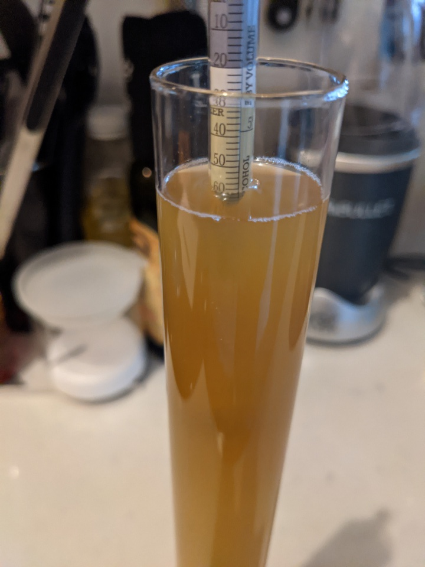

# More NEIPA

My [last NEIPA](brewlog_2020-07-05.md) was delicious and I want
more. Considering how good the last batch was, I probably shouldn't
change anything. But I will anyway. To keep things interesting.

Throwing out the 2-row and golden promise in favour of Maris Otter as
base malt. Bumping up the Flaked Oats to 8 oz because why not?

Hops mostly stay as is, but I'll lower the first wort addition to 0.5
oz. Last batch was just a tad to bitter imho.

No distilled water this time. NY tap water is sufficiently low in ions
that I bet it'll work fine with the same additions as before. Won't
bother with the phosphoric acid though. Not sure why the BYO recipe
had it, considering how distilled or RO water shouldn't be alkaline to
begin with. But what do I know?

As for yeast, I was really happy with Voss but will try Hornindal this
time. The former is said to produce orange and citrus notes, while the
latter gives off more tropical flavours.

## Recipe

- Volume: 2. gal
- 60 minute boil
- Yeast: Hornindal (OYL-091)

Grain:
- 5 lbs Maris Otter
- 8 oz Flaked Wheat
- 8 oz Flaked Oats
- 3 oz Rice Hulls

Water treatment (5 gal NY tap water):
- 3/4 tsp Calcium Chloride
- 1/4 tsp Gypsum

Hops:
- First wort
  - 0.5 oz Amarillo
- Flameout
  - 0.75 oz Amarillo
- Hopstand (20 min)
  - 0.5 oz Citra
  - 0.5 oz Galaxy
  - 0.5 oz Mosaic
- Dry hop (near end of primary fermentation):
  - 1.5 oz Citra
  - 1 oz Galaxy
  - 0.5 oz Mosaic

60 minute mash at 152 F. Hop stand for 20 minutes when wort is at 180
F post boil.

Predictions (Brewer's Friend):
- OG: 1.063
- FG: 1.013
- ABC: 6.49%
- IBU: 35.27
- SRM: 6.39

## Brew day (2020-10-25)

Treated 5 gal water with 1g CaSO4 and 3g CaCl. Heated to 160 F. Added
grains. Mashed for 60 min at 152 F. Raised to 170 and sparged with 1
gal at ~170F. Added first wort hops and fermcap. Brought to
boil. Yeast nutrients at 20 minutes. Flameout and more amarillo
hops. Started cooling down to 180 F after ~5 minutes. Did the hopstand
for 20 minutes, with Foundry maintaining a steady 180
F. Cooled. Whirlpool w paddle, although batteries ran out in cordless
drill halfway through. Let it settle for 40
minutes. Transferred. Pitched yeast.

The wort was a bit darker than last time, as expected given the switch
to Maris Otter. It was also a lot more cloudy:

Big difference from last time. I was a bit worried that this was all
trub that could clog up the fermentor spigot down the line, but it
definitely looked like I had a more solid cone on the bottom of the
kettle.

I forgot to check the wort pH btw. Should've done that.

- OG: 1.059 (Hydrometer)
- OG: 1.059 (Tilt)
