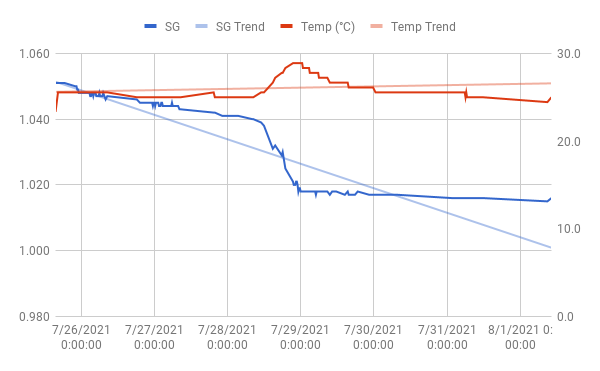

# Even more NEIPA

Haven't brewed in almost a year! Time to break that trend.

This will be a repeat of the previous batch of
[NEIPA](brewlog_2020-10-25.md). Lowering the Amarillo at flameout to
0.5 oz, just to get the total bill to 1 oz. Similarly, I'm adding an
extra 0.5 oz Galaxy at dry hop, putting the total at 2 oz. Citra and
Mosaic remain at 1 oz total.

For yeast, I'll try to make a starter of some harvested Hornindal from
the last batch. It's been refridgerated for over 9 months though, so I
have a dry pack of Lallemand's Voss as backup.

## Recipe

- Volume: 2 gal
- 60 minute boil
- Yeast: Hornindal (OYL-091) (harvested, gen 2)

Grain:
- 5 lbs Maris Otter
- 8 oz Flaked Wheat
- 8 oz Flaked Oats
- 3 oz Rice Hulls

Water treatment (5 gal NY tap water):
- 3/4 tsp Calcium Chloride
- 1/4 tsp Gypsum

Hops:
- First wort
  - 0.5 oz Amarillo
- Flameout
  - 0.5 oz Amarillo
- Hopstand (20 min)
  - 0.5 oz Citra
  - 0.5 oz Galaxy
  - 0.5 oz Mosaic
- Dry hop (near end of primary fermentation):
  - 1.5 oz Citra
  - 1.5 oz Galaxy
  - 0.5 oz Mosaic

60 minute mash at 152 F. Hop stand for 20 minutes when wort is at 180
F post boil.

Predictions (Brewer's Friend):
- OG: 1.063
- FG: 1.013
- ABC: 6.49%
- IBU: 35.27
- SRM: 6.39

## Brew day (2020-07-25)

5 gal NYC tap water w 1g CaSO4 and 3g CaCl. Kept 4 gal in mash tun at
160F and left 1 gal for sparging. Added grains and mashed at 152F for
60 min w recirculation. Up to 170F for the sparge.

**Mistake 1:** Should've mashed in 3 gallons, not 4. So no sparge this
time around. Reduced efficiency to be expected.

Had about 3.5 gal in the kettle after mash. First wort hops, fermcap
and boil for 60 minutes. Flame out and add hops.

**Mistake 2:** Immediately cooled it to 170F w immersion chiller after
adding the flameout hops. Forgot completely it was supposed to drop
slowly. But I doubt I'll be able to tell the difference.

Tossed in the hopstand addition and let it sit around 180F for 20
minutes. Cooled to 80 F.  Whirlpooled w paddle and cordless drill,
which worked great. Let it rest for 40 min then into fermenter with
yeast.

**Mistake 3:** Couldn't find the airlock bung, so I ended up plugging
it with plastic cap that came with the fermenter instead. Certainly
not ideal for an oxygen sensitive beer like this.

The yeast is from the Hornindal I harvested from the last batch on
2020-11-01. Definitely a bit sceptical of yeast that old so I made a
yeast starter the night before, which seemed to be fermenting away
today. Should've checked graivty probably, but eh.

OG: 1.051 (Tilt)

## Dry hopping (2020-07-28)

**Mistake 4:** Using that year old harvested yeast...

After the first 60 hours (!) of fermentation, gravity dropped from
1.051 to 1.041. Way, way, way too slow. Completely off from what I'd
expect from this Kveik. So I decided to cut my losses and pitch some
of the backup Voss I bought. Fermentation took off in a matter of
hours, and about 14 hours later gravity was down to 1.020. Time to dry
hop!

Boiled a hop bag, filled it up and tossed it in.

## Keg (2020-08-01)

Primed with 39g sugar in 3/4 cup water.

Sample looked cloudy and a bit on the dark side, just like last
batch. Smell was nice, but kinda mild. Taste was unfortunately not at
all what I hoped for. Had this sour note to it that I don't like at
all. I suspect this is from the bad yeast I pitched, and I suspect
it'll turn out pretty awful when I try drinking it in 2-3 weeks.

- FG: 10.015 (Hydrometer)
- ABV: 4.7%

