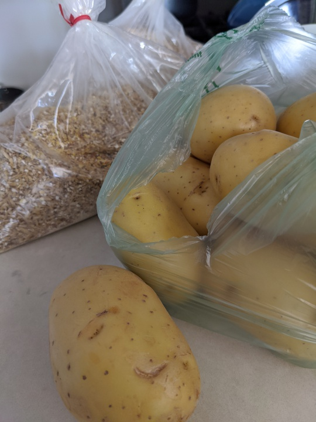
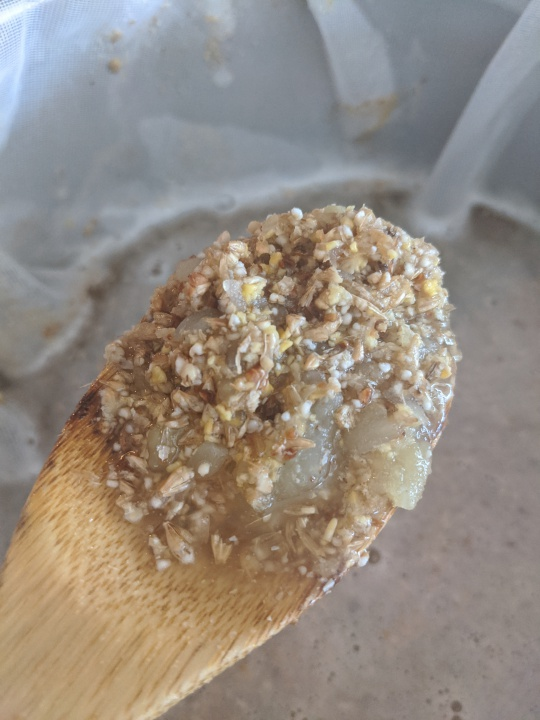
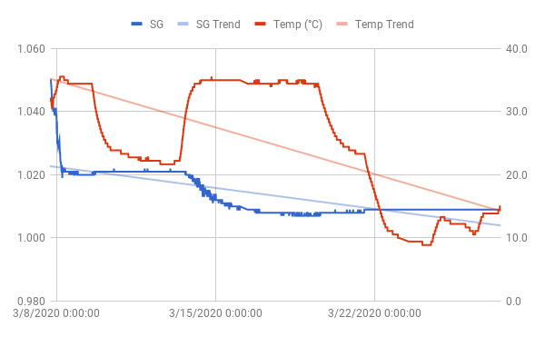

# Potato Pale Ale

Po-ta-toes. Boil 'em, mash 'em, stick 'em in a brew.

*Potatoes and malted grains*

Many years ago, I promished an irishman I'd make him a potato beer in
return for a couple of bottles of Westvleteren 12 he'd given me. This
is my first attempt at that.

I have a mixed bag of pilsner, crystal and flaked corn at home. Had
accidentally failed to check the "mill grains separately" box when I
ordered them, so it was completely useless for the recipes I was
planning (a pale ale and a cream ale). Figured I'd take this
opportunity to use it before it goes bad. Ordered an additional 2 lbs
of Maris Otter to complete the grain bill. Same goes for the hops btw;
it's just a mix of leftovers I happened to have in my freezer

## Recipe

Fermentables:
- 5 lbs Potatoes ("Yellow" from Whole Foods)
- 2 lbs Maris Otter
- 1 lbs Belgian Pilsner
- 10 oz Flaked Corn
- 5 oz Crystal 60L

Hops:
- 0.5 oz Perle (8 AA)
- 0.25 oz Columbus (16 AA)
- 0.1 oz Cascade (6 AA)
- 0.1 oz Chinook (13 AA)

Schedule:
- 60 min: Perle
- 10 min: Columbus
- 0 min: Cascade & Chinook

Yeast: OSLO

Predictions:
- OG 1.052
- FG 1.010
- ABV 5.54%
- IBU 41.4
- SRM 8.25

Although I really doubt that Brewer's Friend is getting the potatoes
right. I'm using an optimal PPG of 7.5 for the calculations. Hoping
for 70% efficiency like last time I did BIAB.

## Brewday (2020-03-07)

Peeled, boiled and mashed (i.e. crushed) the potatoes. Mashed
(i.e. steeped in water) with the grains at 150-156 F for 90
minutes. Mostly at the lower end of that range. Squeezed the grain bag
quite a bit. Didn't really sparge at all.

*Grains and potatoes during mash*

SG is around 1.055. Forgot to record the sample temperature so the
adjustment may be a bit off. But close enough I'm sure. Topped off to
about 2.6-2.7 gal. Added 6 drops Fermcap. Boiled according to
schedule, but with 1/2 whirlfloc tablet added at 10 minutes.

Cooled to about 40 C. Let it stand undisturbed for about 2 hours and
then transferred to fermenter. Really cloudy in spite of that time
span. I imagine that's in part due to the high temperature, but
primarily from the potatoes. Got 2 gallons on fermenter.

Pitched yeast (harvested from my previous pale ale batch), dropped in
my tilt and set it to ferment in a water bath around 35 C.

- OG: 1.052 (Hydrometer)
- OG: 1.050 (Tilt)

## Amylase Enzyme (2020-03-13)

Fermentation took off in no time. After 12 hours it had reached a
final gravity of... 1.020....

Not good. I gave the fermenter another day or so at 35 C and then
turned off the heat. No change in gravity. I suspect that a whole lot
of starch from the potatoes failed to convert during the mash. After
some head scratching, I decided to try adding some amylase
enzyme. Went with 0.1 tsp, which worked out to roughly 0.35
grams. Dissolved this in boiled (but cooled) water and added to
fermenter around 10 AM today. Cranked up the heat again to help the
yeast and the enzymes out as much as possible.

## Kegging (2020-03-27)

Fermentation took off just a few hours after I'd added the
enzymes. Dropped down to 1.007 - 1.009 in about three days, and then
stabilized at 1.009 when I turned the heat off.

*Specific gravity and temperature as reported by Tilt*

This much time in the water bath was not ideal though. I had sealed
off the spigot with a few layers of plastic wrap, secured with cotton
string. When I took it out of the bath, water had clearly seeped in to
the spigot and it all had a very funky smell. I bet the cotton in the
string had started to rot a bit.

But no worries, I just left the spigot closed and used a siphon to
transfer to keg. Used 39 grams of priming sugar in 1/2 cup of water. I
also tried to fill 3 bottles, but it was way to tricky with a siphon
so I just decided to to not bother. In retrospect, it would've worked
better if I used the bottling wand for both keg and bottle, as opposed
to trying to attach it when the keg was full. So no bottles, but 1.5
gal or so on keg.

Taste was ok. Not super exciting, but a pale ale. I noticed that the
aroma the OSLO kveik produced in earlier batches isn't as present
here. The same happened with my latest batch of cream ale. Common
denominator is that they both were fermented at high temperature,
while the earlier batches all fermented in room temperature. Sort of
the opposite of what a regular yeast would do. A bit of shame
actually, since those flavours worked really well in the [Sort of
SNPA](brewlog_2020-02-10.md).

- FG: 1.009 (Tilt)
- ABV: 5.25%

## Note on taste (2020-06-24)

Must've finished the keg in late April or early to mid
May. Unfortunately never took any notes at that time.

But, it was ok. Not great, but drinkable. No major off flavor as far
as I could tell. It was not as tasty as the SNPA, but better than the
red rice ale.
