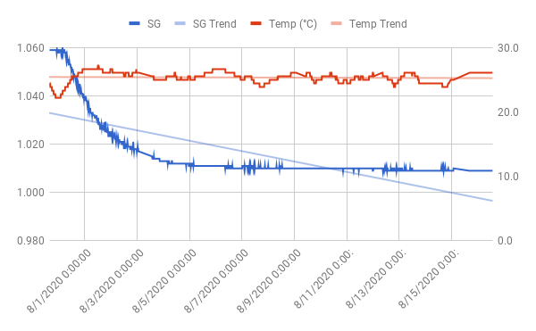

# All-grain SNPA

The [Sierra Nevada Pale Ale clone](brewlog_2020-02-10.mdf) I made in
February was really good. Time to make more of it. This time, it'll be
all-grain in my Anvil Foundry.

I'll do my best to transfer clear wort this time. Hop bag and
whirlpool helped a lot on the recent NEIPA. This time I think I'll try
to use the anvil pump to whirlpool while cooling. If that's
sufficiently vigorous, I'll hopefully not have to stir it manually to
whirlpool. Would also like to use the pump to transfer to fermenter.

I recently started reading _Water: A Comprehensive Guide for Brewers_
by Palmer and Kaminski. Still don't really know what I'm doing, and
I'm only 50 pages in or so. That said, I'll do some water treatment
this time and hopefully learn something new along the way.

Planning to add 5g Gypsum and 2g Calcium Chloride to 5 gal of
water. Plugged that and NYC's water profile into Brewer's Friend's
water calculator and got the levels given below. As a comparison, I
also listed the adjusted water profile of the
[NEIPA](../neipa/brewlog_2020-07-05.md) I brewed with distilled water
earlier this month.

| Brew | Ca | Mg | SO4 | Na | Cl | HCO3 | Alkalinity |
| --- | --- | --- | --- | --- | --- | --- | --- |
| Pale Ale | 96 | 1 | 149 | 8 | 60 | 16 | 13 |
| NEIPA | 56 | 0 | 29 | 0 | 76 | 0 | 0 |

That's a sulfate:chloride ratio of roughly 2.5:1 for the Pale Ale vs
1:2.6 for the NEIPA. I checked the good book, and a Ca level of 96 is
alright (should be at least 50), and SO4 and Cl are also in the
acceptable range. So this should work. Or not. We'll see. I don't know
what I'm doing. Will also treat the water with metabisulfate to remove
rid of chlorine. Calculator says predicted mash pH is 5.35.

This water profile should be suitable for an American Pale Ale. Quite
a bit harder than NY water, which should help the hops shine a bit
more.

## Recipe

Volume: 2.5 gal

Water treatment (5 gal NY municipal):
- 0.25 Campden tablet
- 5 g Gypsum
- 2 g Calcium Chloride

Grains:
- 5 lbs 2-row
- 6 oz Crystal 60L

Hops:
- 1.4 oz Cascade (6.3 AA)

Yeast: OSLO from Bootleg Biology

Boil schedule:
- 60 min: 0.4 oz Cascade
- 30 min: 0.5 oz Cascade
- 0 min: 0.5 oz Cascade

Mash: 60 min @ 155 F

Predictions (brewer's friend):
- OG: 1.055
- FG: 1.011
- ABV: 5.89%
- IBU: 38.88
- SRM: 8.48

## Brewday (2020-07-30)

Treated the water yesterday evening. Mashed at 152F with recirculation
in 3 gal and sparged after 70 minutes with 1 gal at 170F. Mash pH was
5.4. Ended up with 3.4 gal wort at 212F, i.e. roughly 3.3 gal at room
temperature. Added 5 drops of fermcap and brought to a boil. Hops as
per schedule. Also 1/2 whirlfloc tablet and 1 tsp yeast nutrient at 15
minutes. Immersion chiller in at 10 minutes.

Once it had stopped boiling I connected the pump in order to
recirculate while cooling, but that didn't work at all. Pump wouldn't
push through more than a tiny bit of liquid. It took off once the
temperature had dropped a bit more, but I really would've liked to run
some near boiling wort through it for sanitation purposes.

It was good to have the wort moving around though. Got below 80F in 30
minutes or so, which isn't fast, but I spent that whole time cleaning
up instead of stirring and obsessing.

I pulled out the immersion chiller and whirlpooled it manually. The
pump would clearly not cut it. Accidentally banged into the racking
arm and splashed sticky wort on the floor. Fuck this manual stirring
bullshit. I'm gonna buy a whirlpool paddle and attach it to our power
drill for the next batch.

Once cool (~75F), I let it stand for 1 hour so the trub could settle
before transferring to fermenter. The whirlpool hadn't done much good
and I got quite a bit of hazy gunk in the last 0.5 gal. Ended up with
2.0 gal in fermenter.

Pitched a mason jar of harvested kveik. Tried to figure out what
generation I'm on here but it's not entirely clear. First generation
was the [01/25 cream ale](../cream%20ale/brewlog_2020-01-25.md), and
second must've been the [2/23 cream
ale](../cream%20ale/brewlog_2020-02-23.md) (although I also used it
for the [2/10 SNPA](../pale%20ale/brewlog_2020-02-10.md). From that
last Cream Ale I harvested 2 mason jars, and I've been using those for
2 beers since, including this one. Third generation in other
words. Neat.

- OG: 1.055 (Hydrometer)
- OG: 1.059 (Tilt)

## Kegging (2020-08-16)

39 g table sugar in 1/2 cup of water. Then into keg.

Sample did not taste great. I'm a bit hungover atm, so that might be
why.

- FG: 1.009 (Tilt)
- FG: 1.004 (Hydrometer)

Now this is a bit odd. I don't think I've ever had a final gravity as
low as 1.004. Measured SG of a some (roughly room temp) tap water and
got 0.993 from the hydrometer. That also seems off.

Broken hydrometer? Should look into this before the next brew.

- ABV: 6.5%

## Sampling (2020-10-03)

Kept the keg in the fridge for a week and hooked up CO2 yesterday.

Color is a pretty dark caramel. A bit hazy. Didn't get too much foam,
but good head retention. Smells like crystal malt and "homebrew".

Beer is sweet and full bodied. A bit heavy. Hop bitterness is very
present. Dry finish in spite of the body. Almost astringent.

Ok at best, not great.

## Sampling (2020-10-12)

Two weeks in the fridge improved the beer quite a bit. Even felt it
was good enough to serve to friends & family. Still not great, but
definitely ok.

The Oslo flavour mellowed out a bit, as did the bitterness. It's still
very "heavy" though. All that caramel malt I imagine.
