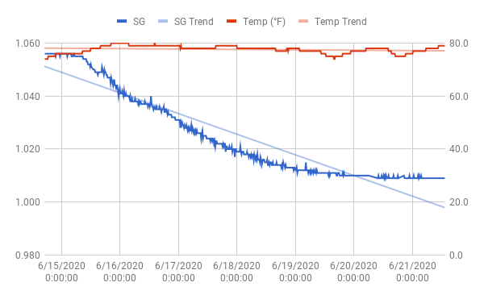

# Bohemian Kveiksody

It's june, and it's hot as hell in New York. Perfect time for drinking
Pilsner, and fermenting at recklessly high temperatures with Kveik.

Volume: 2.5 gal

Yeast: Bootleg Biology OSLO Kveik

Fermentables:
- 5 lbs Bohemian Pilsner malt (floor malted)
- 5 oz Carapils

Hops:
- 1.5 oz Saaz
- 0.4 oz Hallertau

Schedule (60 minute boil):
- 60 min: 1 oz Saaz
- 15 min: 0.4 oz Hallertau
- 15 min: 0.5 oz Saaz

Predictions (Brewer's friend):
- OG:  1.056
- FG: 1.014
- ABV: 5.53%
- IBU: 39.98
- SRM: 3.85

## Brew Day (2020-06-14)

Mashed at 152 F in 3 gal, with recirculation and a 1 gal sparge at 170
F. Got 3.4 gal post sparge. This came in at 1.036 at 114 F, which is
1.043 at 68F. The 3.4 was near boiling temperature, so taking thermal
expansion into account it'd be closer to 3.2 at room
temperature. Reducing this to 2.5 gal puts OG at 1.055.

Boiled according to schedule. Added Fermcap while heating, 1/2 tablet
Whirlfloc and 1 tsp yeast nutrient at 15 min. Cooled to 75 F,
whirlpooled by stirring, let sit for 1 hour, transferred to fermenter.

At this point I had 2.6 gal of wort in kettle. That's 0.6 gal lost,
but precision isn't great so a boil off rate at 0.5 gal / hour seems
plausible. Total in fermenter was around 1.9 gal.

- OG: (Hydrometer): 1.052
- OG: (Tilt): 1.056

Pitched only 1 (heaping) tsp yeast slurry from one of the jars I
harvested from a cream ale in February. Would never do this small a
pitch with a "regular" yeast, but they say Kveik handles it just fine.

Whole process was on the (6.5 gal) Foundry. Worked like a
charm. Really glad I got this thing.

One thing that bugs me though is how I always seem to end up
transferring a lot of kettle trub to hit my fermenter volume. Thanks
to the Foundry's rotating racking arm, the first 1.5 gal was
incredibly clear. To get the final 0.4 gal, I had to turn it below the
trub line.

I could fix this by simply making a larger batch. A kettle volume of 3
gal would probably do the trick (but would waste malt and
hops). Another option is to come up with a way of creating a better
whirlpool than what I get by stirring (perhaps a whirlpool
paddle?). Third option is to somehow reduce the amount of trub (start
using hop bags?). Fourth is to use some a of trub filter when racking
(although every time I've tried that in the past it just ended up
getting clogged).

Should pick one of the above ideas and try it out next brew day.

## Kegging (2020-06-21)

A bit over 12 hours lag time before gravity started
dropping. Fermenter lid doesn't seal tightly without teflon tape, and
I had run out, so I saw no airlock activity. Took about 5 days for it
to ferment out. Longer than I expected for this yeast, but makes sense
given the very small pitch.

Primed with 39 g sugar in 1/2 cup of water for keg, and 2.2 g per
bottle. Got 1.5 gal on keg and 2 bottles. Was able to use the
fermentor faucet this time.

- FG: 1.009 (Tilt)
- FG: 1.007 (Hydrometer
- ABV: 5.9% (Hydrometer)

Sample was really tasty. Pretty bitter and a bit alcoholic. Hopefully
that'll settle down until when it's carbonated.
