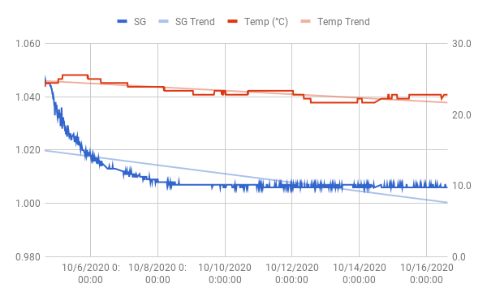

# Bohemian Kveiksody 2

Taking another stab at (pseudo) pilsner. Going to roll with pretty
much the same recipe as before, but this time using Omega's Lutra
Kveik.

Volume: 2.5 gal

Yeast: Omega Yeast Lutra Kveik

Fermentables:
- 5 lbs Bohemian Pilsner malt (floor malted)
- 5 oz Carapils

Hops:
- 1.5 oz Saaz
- 0.4 oz Hallertau

Schedule (60 minute boil):
- 60 min: 1 oz Saaz
- 15 min: 0.4 oz Hallertau
- 15 min: 0.5 oz Saaz

Predictions (Brewer's friend):
- OG: 1.056
- FG: 1.012
- ABV: 5.74%
- IBU: 35.1
- SRM: 3.75

## Brew day

Gonna keep track of time this session. See if I can speed up brew day
a bit.

- *10:00*: Filled kettle w 3 gal. Set temp to 157 F.
- *10:30*: Mash temp reached. Added grains and ~1 pint of rice
   husks. Set temp to 152 F. No recirculation today. In part to reduce
   labour, in part just to see what it does to my efficiency. Stirred
   the mash every 15 minutes or so.
- *11:30*: Sparged with 1 gal at 170 F and started bringing to boil. 5
   drops Fermcap S.
- *12:00*: Boiling. Hops according to schedule, in a hop bag.
- *12:50*: 1/2 tablet whirlfloc and 1 tsp yeast nutrient. Wort chiller
   into kettle.
- *13:00*: Flame out. Started cooling.
- *13:30*: Hit 80 F. Stopped cooling. Whirlpool with paddle and
   cordless drill.
- *13:40*: Let it settle. Went for a bike ride.
- *15:00*: Transfer to fermenter. Pitch yeast.
- *15:15*: Start cleaning.
- *15:45*: Done.

Whirlpool paddle worked great and I got a decent trub cone.
Transferred very clear wort. So clear that I collected a total of 2.1
gal from the 2.5 I had in the kettle.

It looked like it had settled well enough to transger at 14:00,
i.e. 20 minutes after whirlpool. Perhaps no need for these hour long
waits I've done before.

Gravity is incredibly low though. Efficiency of 55% or so, as opposed
to the perhaps 70% I'd guess I normally get. No recirculation, and I
didn't bother with the perforated plate when sparging. Probably
looking at a 4.5% ABV beer here.

- OG: 1.045 (Tilt)
- OG: 1.043 (Hydrometer)

## Keg and bottle (2020-10-17)

Poured off just over a pint before I got clear beer out of the
spigot. Primed the keg with 39 g table sugar, and 2.2g per
bottle. Ended up with 1 full 1.5 gal keg and 4 16 oz bottles.

Didn't bother taking a hydrometer reading, but Tilt has reported a
stable 1.006 for a long time. Would have wanted to keg this a week
ago, but a trip upstate got in the way.

- FG: 1.006 (Tilt)
- ABV: 5.1%

Sample was clear and tasted incredibly clean. Bitterness seemed spot
on for a Czech pilsner. None of that weird OSLO flavour I've had in
previous stabs at light beer. Incredibly impressed by Lutra so
far. Will obviously not know for sure until several weeks from
now. Either way, I made sure to harvest a small mason jar of the
slurry.

Plan is to let this carbonate over 2 weeks, lager for 3.5 weeks in my
beer fridge and finally serve it on thanksgiving.
