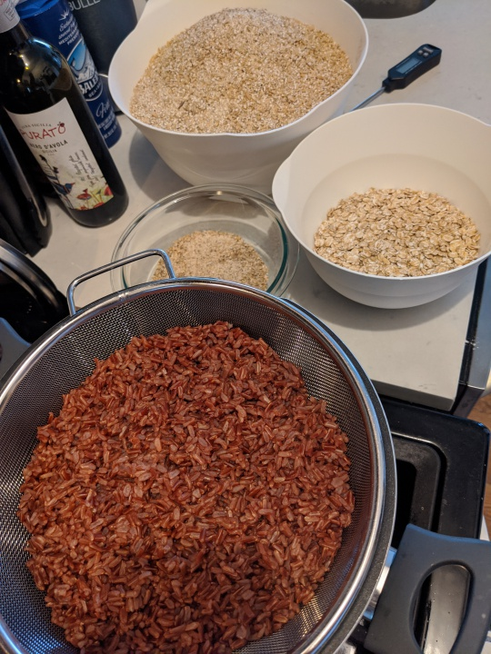
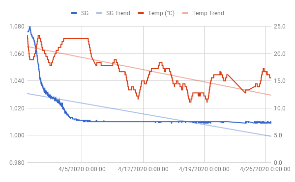

# Red Rice Ale

Inspired by Hitachino Nest Red Rice Ale.

The original uses Flaked Barley and Red Rice according to [their
website](https://hitachino.cc/en/beer/). It's not entirely clear to me
what "red rice" really means here. Could be [red rice
koji](https://en.wikipedia.org/wiki/Red_yeast_rice), a.k.a. red yeast
rice, which might be what brings the beer it's pink hue. Could also be
just a minor addition of koji, with the bulk being regular [red
rice](https://en.wikipedia.org/wiki/Red_rice).

I decided to go with red rice, since that was very easy to find on
Amazon in a large enough volume. I don't think it'll add any color to
the beer, but who knows. Red yeast rice should be easy to find in
chinatown, but with Covid-19 I'd rather not leave Brooklyn.

*Boiled red rice and malts*

## Recipe

Volume: 2.5 gal

Fermentables:
 - 4.8 lbs Pilsner malt
 - 1 lbs Red Rice
 - 0.5 lbs Flaked Barley
 - 4 oz Carapils 1.8 L

Hops:
 - 9 grams Chinook 13 AA

Schedule:
 - 60 min: 3g Chinook
 - 20 min: 3g Chinook
 - 5 min: 3g Chinook

Yeast: US-05

Predictions:
 - OG: 1.068
 - FG: 1.013
 - ABV: 7.2%
 - IBU 17.95
 - SRM 3.79

Boil the rice for 30 minutes to gelatinize, then mash w grains.

## Brew day (2020-03-29)

Brewing with C, who originally suggested we try to clone this beer.

Washed the rice and then boiled in 0.5 gal water for 30 minutes. While
the rice lost some of its red color in the boil, the water itself
turned a dark red. Strained it off into the main kettle and got about
1/4 gal.

Added water to reach 1.5 gal total, heated to perhaps 155, added
grains and rice in bag. Temp dropped to 135-140. Tried pulling up bag
and heating, but the grain to water ratio made this difficult. Ended
up heating and adding an additional 0.5 gal water instead.

Mashed for 60 minutes at roughly 150F, although it definitely spent
some time below that. Perhaps 145.

After squeezing the grain bag and topping off with water to 2.5 gal,
my hydrometer reading, adjusted for temperature, came in at
1.053. That's not at all what we want.

So what went wrong? Not sure. Perhaps I should've boiled the rice
longer, and tried to crush it up a bit before mashing it?

Anyway, we need 14 additional gravity points. With 2.5 gal, that means
35 points from extract. 1 lbs of DME is 44 ppg, so 35/44=0.8 lbs of
DME should put us at 1.068. I guess it won't be as much of a "red
rice" beer as intended, but it'll be beer!

Had 9 oz Briess golden light DME in a zip lock bag, so I added that,
and an additional 3 oz table sugar to hit ~0.8 oz. Good enough.

Boil went fine. Add fermcap before, and also whirlfloc at 10
minutes. Cooled and transferred 2 gal to fermentor. Lots of cloudy
trub that didn't settle in spite of leaving it for 1 hour. Guessing
that's due to the flaked barley? Pitched yeast, aerated, tossed in the
Tilt and off we go.

But then the first Tilt reading back in at 1.076. Wth? That's 8 points
too high. Took a hydrometer sample and that came in at 1.074. Volume
in kettle was 2.5 gal. When I took it off the burner. No clue what's
going on.

Whatever. It'll be beer.

 - OG: 1.076 (Tilt)
 - OG: 1.074 (Hydrometer)

## Bottle and keg (2020-04-26)

A thick cake of yeast on the bottom. Got 1 bottle and 1 1.5 gal keg
before I started seeing a bit more trub than I'd like.

Long day of cleaning afterwards, as I decided to also clean my brand
new Anvil Foundry 6.5 gal.

*Specific gravity and temperature, as reported by Tilt*

- FG: 1.010 (Tilt)
- ABV: 8.7%
