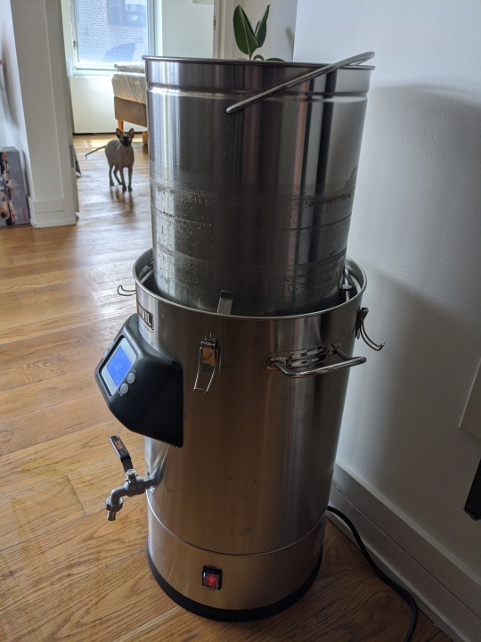
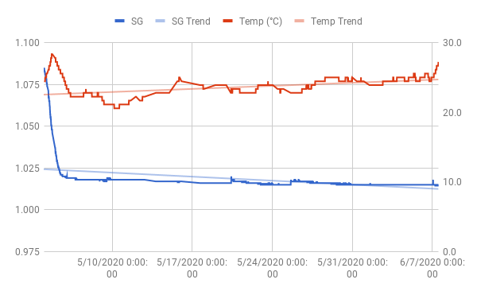

My favourite brew from the past year has definitely been the Raging
Queen Belgian IPA. I think a lot of that owes to it being strong, and
to the belgian yeast I used. So I decided it was time to make another
strong, belgian ale.

Westmalle Tripel. Always liked that one. I found [this
recipe](http://www.candisyrup.com/uploads/6/0/3/5/6035776/westmalle_tripel_-_041.pdf)
referenced on a couple of forums and decided to go for it. As always,
some minor modifications here and there.

## Recipe

2.5 gal

Fermentables:
- 6.25 lbs Pilsner malt
- 1 lbs Belgian Candi Syrup (Golden, D5)
- 2 oz table sugar

Hops:
- 0.4 oz Saaz
- 0.5 oz Hallertau
- 0.75 oz Celeia

Yeast: Lallemand Abbaye Ale Dry Yeast

Schedule (90 minute boil):
- 60 min: 0.4 oz Saaz
- 45 min: 0.5 Hallertau
- 20 min: 0.75 Celeia
- 10 min: Whirfloc

Mash:
- 20 min @ 124 F
- 60 min @ 147 F
- 15 min @ 170 F

The recipe calls for doing a decoction to raise from 124 to 147, but I
really don't want to deal with that.

Predictions (Brewer's Friend):

- OG: 1.081
- FG: 1.008
- SRM: 5
- IBU: 40
- ABV: 9.6%

I bet this could be cut down to a 60 minute boil and a 60 minute mash
(at 147 F), but might as well stick to the recipe where it's not a
hassle.

## Brew day (2020-05-03)

This is my first time brewing on my brand new 6.5 gallon Anvil
Foundry. So exciting!

Looking at ~6 lbs grain and a 2.5 gal batch. Will definitely do a
sparge. The Anvil Foundry manual says I should use 3 gal strike water
and 1 additional gal for the sparge. A strike temp of 158 is expected
to drop to 152 with grains. I want to hit 124 F, so I'm putting strike
temp at 128 F. Guesstimating here. Set the timer on the Anvil and had
the strike water waiting for me in the morning.

The Foundry manual says boil off should be about 0.5 gal per
hour. Since I'm doing a 90 minute boil, I'll be adding an extra 0.25
gal of strike water, so 1.25 in total.

Summary:
- 3 gal strike water at 128 F
- 1.25 gal sparge water at 170 F

And that strike temperature was spot on. Landed exactly at 124F with
grains.

Mash went ok, but got completely stuck once.  Easy to fix once I
understood what was going on. Recirculation was bit iffy too; I had to
adjust the flow several times. But it worked out. Post sparge, I had
3.5 gal. 0.25 higher than planned, but ok.

But even so, this was fun. The temperature control alone is incredibly
convenient and seemed to be spot on when I checked with a separate
thermometer.

The 3.5 gal had SG 1.036 at 153 F, which is 1.053 at 68F. Added 1 lbs
candi sugar (PPG 1.032), and 2 oz table sugar (PPG 1.042), which
should push up SG by 10-11 points by my math, so that's say
1.063. Still 3.5 gal, or a bit more even with the candi sugar
added. Reduced to 2.5 gal that's an OG of 1.088. A bit too high.

However, the foundry should have a boil off rate of roughly 0.5 gal
per hour. With our 90 minute boil, that means a post boil volume of
2.75 gal, which puts OG at 1.080. Almost spot on.

Boil was a breeze. Added hops according to schedule. Cooled with the
included immersion chiller. That was very nice, and a big improvement
from mucking around with ice baths. Got down to 70F in 15 minutes or
so.

Somehow ended up with exactly 2.5 gal post boil. Could've diluted up
to 2.75 to hit OG, but didn't. Transferred to fermenter, aerated,
pitched the yeast.

- OG: 1.087

## Stalled fermentation (2020-05-09)

Oh boy. Fermentation took off pretty quickly. I checked the
temperature and it seemed to be stable at roughly 24 C. Warm, but ok
for this yeast I would think. A day later I checked again, and
realized it had been fermenting as high as 28 C. Oy vey.

Three days after brewday, it sat at a steady 1.018, and has been there
since. I'm aiming for 1.010, so something needs to change. I tried to
agitate the yeast by swooshing the fermenter around a bit but no
cigar.

Today I added a whole pack of S-04 yeast and wrapped it in a
blanket.

## Fermentation update (2020-05-13)

No change to SG according to tilt over the past 4 days, but I took a
hydrometer reading today and it came in at 1.014. I think that's close
enough to call it done. Not ideal, but good enough.

## Yeast re-starter (2020-05-19)

I felt the sample from the 13th tasted a bit too sweet, and the more I
thought about it the less happy I felt about being 6 points above
target. So I decided to make a small yeast starter to see if I can
push it down to 1.008. Probably not entirely necessary, but kind of
interesting so why not?

Starter:
 - 2.3 oz Pilsen DME
 - 2 cups water
 - 1.5 tsp yeast nutrient
 - a sprinkle of US-05

Boiled for 5-10 minutes. Chilled to 22 C. Pitched just a little bit of
yeast. Half a teaspoon at most. Shook it all like crazy to
aerate. Covered with aluminum foil and left it to do its thing.

Not much activity during the first 12 hours. Just a thin layer of
foam. Checked again about 12 hours later and had a thicker layer of
foam. Figured peak krausen probably happened overnight, so I went
ahead and pitched it. SG went from 1.016 to 1.018, according to Tilt.

## Well, that didn't work (2020-05-21)

SG is now hovering between 1.017 and 1.016. I see two possibilities:

1. The yeast culture had not yet grown strong enough to restart the
   stuck fermentation
2. Fermentation is actually not stuck; there's just a whole lot of
   unfermentables in there.

Considering how low my mash temperature was (147F), I don't think 2
looks all that likely.

Let's do some math on the starter:

2.3 oz DME in 2 cups water should produce a starter OG around
1.050. Let X denote the starter's SG when it was pitched to
fermenter. We added 0.125 gal at SG X to 2 gal at SG 1.016.

0.125 * X + 2 * 16 = 2.125 * 18

So X = (2.125 * 18 - 2 * 16) / 0.125 = 50

If this is correct, starter gravity may well have been around
1.050. In other words, fermentation had not started. But then again,
the margin of error is pretty large so I'm not really sure.

I guess I'll do another starter then, and make sure I see some serious
activity before I pitch it.

## Yeast re-re-starter (2020-05-25)

I did a test starter with some harvested OSLO Kveik slurry that I had
in the fridge. After 12 hours, it was actively fermenting. After 24
hours, it appeared to have slowed down. Gravity was around
1.015-1.020.

Last night around 9 PM, I made another starter. 2.3 oz Pilsen, DME, 2
cups water, a pinch of yeast nutrient and one teaspoon of OSLO
slurry. Pitched that today at 3 PM. This sucker was definitely
actively fermenting, and had been for at least 6 hours.

Beer was at 1.015 and shot up to 1.017 with the starter (says
Tilt). That increase is roughly what I got last time, but yeah, large
margin of error so I'm not sure what conclusion to draw.

I'll bottle this next weekend, regardless of gravity.

## Kegging (2020-06-07)

Original plan was to bottle this whole batch, but bottling sucks. And,
with all the tinkering I've been doing, and the high fermentation
temperature, I'm not so sure I expect this to be a beer worth
aging. But mostly I'm just lazy.

So I kegged about 1.4 gal, and filled 4 12 oz bottles. Primed with 50
g sugar in 1 cup of water for the keg, and 2.2 g dry table sugar in
each bottle.

- OG: 1.011 (Hydrometer)
- OG: 1.015 (Tilt)

I really don't think these starters were worth the effort. Seems like
it got me 1 gravity point at most. But it was kinda fun so whatever.
